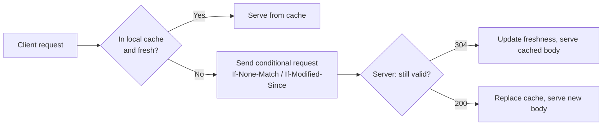

# Knowledge Summary (Cheat Sheet / Mental Model)

A good summary is not a shorter version of the source. It's a *reorganization* of the material around the structures that make it usable. The summary's job is to make the topic **operable** — easy to recall, apply, and explain — not to be exhaustive.

Use this when:
- The user wants a one-page reference they can look at later
- The topic has a lot of moving parts that are hard to hold in mind at once
- The user is preparing for an oral discussion (interview, presentation, talk)
- A learning session is wrapping up and the user needs a "north star" document

## Structure of a good summary

A summary has five sections, in this order. Some can be skipped if the topic doesn't warrant them.

### 1. The one-line frame

What is this topic, in plain language, in one sentence? Not a textbook definition — the *why does this exist* sentence.

> Example: "Database indexes trade extra writes and storage for dramatically faster reads on specific access patterns."

This is the hook the rest of the summary hangs on. Get it right.

### 2. The core mental model

A diagram, framework, or conceptual map. The smallest set of pieces and relationships that captures how the topic works.

Common shapes:
- A **flowchart** of state transitions or process steps (use Mermaid for these)
- A **2x2 matrix** of trade-offs (e.g., consistency vs. availability)
- A **layered diagram** (the OSI model, the React render lifecycle)
- A **list of primitives** with their interactions (CSS box model: margin / border / padding / content)

If the topic doesn't have an obvious shape, *invent one*. A made-up structure that helps the user organize their thinking is better than a sprawl of disconnected facts.

### 3. The key principles / patterns

The rules that govern the topic. 3–7 items, each one a sentence or two. Order them by leverage — the most decision-relevant ones first.

> Example, for SQL query performance:
> 1. *Predicate pushdown matters most* — filtering early reduces work for everything downstream.
> 2. *Join order matters more than join algorithm* — the optimizer's choices come from cardinality estimates, so help it via stats.
> 3. *Indexes only help if the predicate is sargable* — `WHERE date(col) = ...` defeats an index on `col`.
> 4. *Memory beats disk* — keep working sets in cache, even if it costs you compute.

### 4. The decision rules / when-to-use

If the topic involves choices, give heuristics: *use X when ___, use Y when ___.* Make them concrete enough to apply.

> Example, choosing between a hash and a B-tree index:
> - **Hash**: only equality lookups, no range queries; uses less space; exact-match key-value patterns
> - **B-tree**: equality + range; supports ordering; the default for general use

### 5. The traps / common mistakes

What do people get wrong about this topic? Where are the foot-guns? This section is gold for users prepping for interviews or peer discussions — they'll be asked about exactly these things.

> Example:
> - Don't add an index to every column — write amplification will dominate.
> - Don't forget that an index on `(a, b)` works for queries on `(a)` but not on `(b)` alone.
> - Don't trust `EXPLAIN` without `ANALYZE`; cost estimates can be way off.

## Formatting

Output as a single, well-titled markdown file. Use:

- `#` for the title (the topic name)
- `##` for the five sections
- Mermaid blocks for diagrams (rendered automatically in many viewers)
- Tables for trade-off comparisons
- Code blocks for examples

Keep total length to ~1–2 screens. If you're going beyond that, you're writing a textbook chapter, not a cheat sheet — split.

## Generating from source material

When you have source material to summarize:

1. **First, read it for structure** — what are the major sections, what do they cover?
2. **List the 5–10 most important facts/claims** without yet trying to organize them.
3. **Look for the underlying shape**. Is it sequential? Hierarchical? Trade-off-based? Pick the structure that fits.
4. **Reorganize the facts under the shape**. This is the active step where you create value the source didn't.
5. **Add the traps section from the user's likely failure modes** — what would a beginner get wrong here?

Don't just compress the source. Your value is in the *reorganization*.

## Common failure modes

- **Bullet-list dump.** A summary that's just every fact from the source as a bullet point. No structure, no leverage. Useless.
- **Excessive faithfulness.** Refusing to omit anything because "the source covered it". The whole point is selection — you're saying *these* things matter.
- **Fake-precise language.** Mimicking textbook phrasing because it sounds rigorous. Use the user's vocabulary level, not the source's.
- **No mental model.** Skipping section 2 because the topic "doesn't have a diagram". Find or invent one.
- **No traps section.** This is where the highest-density learning lives. Don't skip it.

## Example

Topic: HTTP caching

```markdown
# HTTP Caching — Cheat Sheet

## The frame
Caching is the negotiation between *the server saying "this is fresh until X"* and *the client/proxy deciding whether to trust that*.

## Core mental model



## Key principles

1. **Two timescales**: *freshness* (how long the response is good without checking) and *validation* (cheap check when freshness expires).
2. **Cache-Control trumps Expires**. Use `Cache-Control: max-age=N, public/private`.
3. **ETags > Last-Modified** for accuracy. Use both for compatibility.
4. **Vary header is a footgun**. Every value in `Vary` multiplies cache entries.
5. **Immutable assets** (`max-age=31536000, immutable`) are the easiest performance win.

## Decision rules

| Resource type        | Cache-Control |
|---------------------|---------------|
| HTML page (per-user) | `private, no-cache` |
| Public API GET       | `public, max-age=60` |
| Versioned static asset (`/app.abc123.js`) | `public, max-age=31536000, immutable` |
| User profile JSON    | `private, max-age=300` |
| Authenticated bytes  | `private, no-store` |

## Traps

- **`no-cache` doesn't mean "don't cache"** — it means "always validate before serving". For "don't store at all", use `no-store`.
- **Mixing CDN and browser caching**: the response goes to *both*. A 1-hour CDN cache + 1-second browser cache is fine; a 1-second CDN + 1-hour browser is broken.
- **Forgetting Vary on Accept-Encoding**: serves gzipped content to clients that didn't ask for it.
- **Setting cookies on cacheable responses**: leaks one user's data to another. Either don't set the cookie or mark `private`.
```

That's the shape. The user gets one screen, organized so they can find what they need fast, ending with the things that bite people.
